# Teaching-HEIGVD-SRX-2021-Laboratoire-Firewall

Auteurs : Ryan Sauge, Dylan Canton

**Travail à réaliser en équipes de deux personnes.**

**ATTENTION : Commencez par créer un Fork de ce repo et travaillez sur votre fork.**

Clonez le repo sur votre machine. Vous retrouverez notamment dans ce repo les ficher `Dockerfile` et `docker-compose.yml` indispensables pour l'ajout des conteneurs et configuration du réseau.

Vous pouvez répondre aux questions en modifiant directement votre clone du README.md ou avec un fichier pdf que vous pourrez uploader sur votre fork.

**Le rendu consiste simplement à compléter toutes les parties marquées avec la mention "LIVRABLE". Le rendu doit se faire par une "pull request". Envoyer également le hash du dernier commit et votre username GitHub par email au professeur et à l'assistant**

## Table de matières

[Introduction](#introduction)

[Echéance](#echéance)

[Topologie](#topologie)

[Adressage](#plan-dadressage)

[Cahier des charges du réseau](#cahier-des-charges-du-réseau)

[Regles de filtrage](#regles-de-filtrage)

[Installation de l’environnement virtualisé](#installation-de-lenvironnement-virtualisé)

[Tests des connections et exemple de l'application d'une règle](#tests-des-connections-et-exemple-de-lapplication-dune-règle)

[Règles pour le protocole DNS](#règles-pour-le-protocole-dns)

[Règles pour les protocoles HTTP et HTTPS](#règles-pour-les-protocoles-http-et-https)

[Règles pour le protocole ssh](#règles-pour-le-protocole-ssh)

[Règles finales iptables](#règles-finales-iptables)

## Introduction

L’objectif principal de ce laboratoire est de familiariser les étudiants avec les pares-feu et en particulier avec netfilter et iptables. 
En premier, une partie théorique permet d’approfondir la rédaction de règles de filtrage.

Par la suite, la mise en pratique d’un pare-feu permettra d’approfondir la configuration et l’utilisation d’un pare-feu ainsi que la compréhension des règles.

## Auteurs

Ce texte se réfère au laboratoire « Pare-feu » à suivre dans le cadre du cours Sécurité des Réseaux, 2021, version 7.0.  Au cours du temps, il a été rédigé, modifié et amélioré par les co-auteurs suivants : Gilles-Etienne Vallat, Alexandre Délez, Olivia Manz, Patrick Mast, Christian Buchs, Sylvain Pasini, Vincent Pezzi, Yohan Martini, Ioana Carlson, Abraham Rubinstein et Frédéric Saam.

## Echéance 

Ce travail devra être rendu le dimanche après la fin de la 2ème séance de laboratoire, soit au plus tard, **le 01 avril 2021, à 23h59.**

# Réseaux cible

## Topologie 

Durant ce laboratoire, nous allons utiliser une seule topologie réseau :


Notre réseau local (LAN) sera connecté à Internet (WAN) au travers d’un pare-feu. Nous placerons un serveur Web en zone démilitarisée (DMZ). 

Par conséquent, nous distinguons clairement trois sous-réseaux : 

- Internet (WAN), le réseau de l'école ou votre propre réseau servira de WAN,
- le réseau local (LAN),
- la zone démilitarisée (DMZ). 

Ce réseau sera créé de manière virtuelle. Il sera simulé sur un seul ordinateur utilisant trois conteneurs Docker basés sur le système d’exploitation Ubuntu :

- La première machine, Firewall, fait office de pare-feu. Elle comporte trois interfaces réseaux. Afin que ce poste puisse servir de pare-feu dans notre réseau, iptables sera utilisé.
- La seconde machine, Client\_In\_LAN, fait office de client dans le réseau local (LAN). 
- La dernière machine, Server\_In\_DMZ, fait office de serveur Web en (DMZ).

Nous allons utiliser les trois interfaces réseaux de la machine Firewall afin de pouvoir connecter le LAN et la DMZ à Internet (WAN). Les machines Client\_In\_LAN et Server\_In\_DMZ comportent chacune une interfaces réseau eth0.

## Plan d'adressage

Afin de bien spécifier le réseau, il est nécessaire d’avoir un plan d'adressage précis. C'est la liste des réseaux que vous utiliserez, comprenant pour chaque interface l'adresse IP ainsi que le masque de sous-réseau.
Pour ce laboratoire, nous vous imposons le plan d’adressage suivant :

- Le réseau "LAN" &rarr; 192.168.100.0/24
- Le réseau "DMZ" &rarr; 192.168.200.0/24
- Le réseau "WAN" sera défini par le NAT interne du réseau Docker

Les adresses IP sont définies dans le schéma ci-dessous :


## Cahier des charges du réseau

Avant de configurer les règles, il est primordial de connaître les besoins de notre réseau. Ceci afin de laisser passer les flux légitimes lors de la rédaction des règles.

Le but du **LAN** est de fournir aux utilisateurs de votre réseau un accès à Internet ; à certains services de base uniquement en empêchant les connexions provenant de l'extérieur. Il faudra tout de même laisser entrer les paquets répondants aux requêtes de notre LAN. Une seule machine est présente sur ce réseau. Il s’agit de la machine dont le nom est **Client\_In\_LAN**. (il est très facile de rajouter de machines supplémentaires sur le LAN utilisant Docker).

La **DMZ** est un réseau réservé aux serveurs que l'on veut rendre accessibles depuis l'extérieur et l’intérieur de notre réseau. Par exemple, si nous voulons publier un site web que l'on héberge, il faut accepter des connexions sur le serveur web; dans ce cas, nous ne pouvons pas le placer dans le LAN, cela constituerait un risque. Nous accepterons donc les connexions entrantes dans la DMZ, mais seulement pour les services que l'on désire offrir. Le serveur Web situé dans la DMZ est simulé par la machine **Server\_In\_DMZ**.

Le **WAN** n'est que l'accès à Internet. Il est connecté au réseau de l'école ou à votre propre à travers le système de réseau fourni par Docker.

Pour établir la table de filtrage, voici les **conditions à respecter** dans le cadre de ce laboratoire :

1.	Les **serveurs DNS** utilisés par les postes dans le LAN sont situés sur le WAN. Les services DNS utilisent les ports UDP 53 et TCP 53.
2.	Laisser passer les **PING** uniquement du LAN au WAN, du LAN à la DMZ et de la DMZ au LAN pour les tests. Le ping utilise le protocole ICMP (echo request et echo reply).
3.	Les clients du **LAN** doivent pouvoir ouvrir des connexions HTTP pour accéder au web. Le protocole HTTP utilise les ports TCP 80 et typiquement aussi le 8080.
4.	Les clients du **LAN** doivent pouvoir ouvrir des connexions HTTPS pour accéder au web. Le protocole HTTPS utilise le port TCP 443.
5.	Le serveur **web en DMZ** doit être atteignable par le WAN et le LAN et n'utilise que le port 80.
6.	Le serveur de la DMZ peut être commandé à distance par **ssh** depuis votre client du LAN **uniquement**. Le service ssh utilise le port TCP 22.
7.	Le firewall peut être configuré à distance par **ssh** depuis votre client du LAN **uniquement**.
8.	**Toute autre action est par défaut interdite**.

# Regles de filtrage

<ol type="a" start="1">
  <li>En suivant la méthodologie vue en classe, établir la table de filtrage avec précision en spécifiant la source et la destination, le type de trafic (TCP/UDP/ICMP/any), les ports sources et destinations ainsi que l'action désirée (<b>Accept</b> ou <b>Drop</b>, éventuellement <b>Reject</b>).
  </li>                                  
</ol>

_Pour l'autorisation d'accès (**Accept**), il s'agit d'être le plus précis possible lors de la définition de la source et la destination : si l'accès ne concerne qu'une seule machine (ou un groupe), il faut préciser son adresse IP ou son nom (si vous ne pouvez pas encore la déterminer), et non la zone. 
Appliquer le principe inverse (être le plus large possible) lorsqu'il faut refuser (**Drop**) une connexion._

_Lors de la définition d'une zone, spécifier l'adresse du sous-réseau IP avec son masque (par exemple, "/24" correspond à 255.255.255.0) ou l'interface réseau (par exemple : "interface WAN") si l'adresse du sous-réseau ne peut pas être déterminé avec précision._

---

**LIVRABLE : Remplir le tableau**

|      Adresse IP source      |   Adresse IP destination    | Type | Port src | Port dst | Action |
| :-------------------------: | :-------------------------: | :--: | :------: | :------: | :----: |
|   192.168.100.0/24 (LAN)    |        interface WAN        | UDP  |    *     |    53    | ACCEPT |
|        interface WAN        |   192.168.100.0/24 (LAN)    | UDP  |    53    |    *     | ACCEPT |
|   192.168.100.0/24 (LAN)    |        interface WAN        | TCP  |    *     |    53    | ACCEPT |
|        interface WAN        |   192.168.100.0/24 (LAN)    | TCP  |    53    |    *     | ACCEPT |
|   192.168.100.0/24 (LAN)    |        interface WAN        | ICMP |    *     |    *     | ACCEPT |
|        interface WAN        |   192.168.100.0/24 (LAN)    | ICMP |    *     |    *     | ACCEPT |
|   192.168.100.0/24 (LAN)    |   192.168.200.0/24 (DMZ)    | ICMP |    *     |    *     | ACCEPT |
|   192.168.200.0/24 (DMZ)    |   192.168.100.0/24 (LAN)    | ICMP |    *     |    *     | ACCEPT |
|   192.168.200.0/24 (DMZ)    |   192.168.100.0/24 (LAN)    | ICMP |    *     |    *     | ACCEPT |
|   192.168.100.0/24 (LAN)    |   192.168.200.0/24 (DMZ)    | ICMP |    *     |    *     | ACCEPT |
|   192.168.100.0/24 (LAN)    |        interface WAN        | TCP  |    *     |    80    | ACCEPT |
|        interface WAN        |   192.168.100.0/24 (LAN)    | TCP  |    80    |    *     | ACCEPT |
|   192.168.100.0/24 (LAN)    |        interface WAN        | TCP  |    *     |   8080   | ACCEPT |
|        interface WAN        |   192.168.100.0/24 (LAN)    | TCP  |   8080   |    *     | ACCEPT |
|   192.168.100.0/24 (LAN)    |        interface WAN        | TCP  |    *     |   443    | ACCEPT |
|        interface WAN        |   192.168.100.0/24 (LAN)    | TCP  |   443    |    *     | ACCEPT |
|   192.168.100.0/24 (LAN)    | 192.168.200.3 (SERVEUR WEB) | TCP  |    *     |    80    | ACCEPT |
| 192.168.200.3 (SERVEUR WEB) |   192.168.100.0/24 (LAN)    | TCP  |    80    |    *     | ACCEPT |
|        interface WAN        | 192.168.200.3 (SERVEUR WEB) | TCP  |    *     |    80    | ACCEPT |
| 192.168.200.3 (SERVEUR WEB) |        interface WAN        | TCP  |    80    |    *     | ACCEPT |
| 192.168.100.3 (CLIENT LAN)  | 192.168.200.3 (SERVEUR WEB) | TCP  |    *     |    22    | ACCEPT |
| 192.168.200.3 (SERVEUR WEB) | 192.168.100.3 (CLIENT LAN)  | TCP  |    22    |    *     | ACCEPT |
| 192.168.100.3 (CLIENT LAN)  |          FIREWALL           | TCP  |    *.    |    22    | ACCEPT |
|  192.168.100.2 (FIREWALL)   |          FIREWALL           | TCP  |    22    |    *     | ACCEPT |
|              *              |              *              |  *   |    *     |    *     |  DROP  |

---

# Installation de l’environnement virtualisé

Ce chapitre indique comment installer l'environnement. Il se base sur des outils gratuits, téléchargeables sur Internet.

## Matériel
Il est possible d’utiliser les mêmes instructions sur une version de Windows ou un système Linux ou Mac OS X.

Afin d'installer les différents logiciels présentés ici, il faut disposer d’un ordinateur (avec les droits administrateur).

## Installation de Docker
Docker est un logiciel permettant de créer des conteneurs virtuels afin de simuler diverses configurations. Nous l'utiliserons pour exécuter les trois machines dont nous aurons besoin pour ce laboratoire. L’installation de Docker ne comporte pas de difficulté particulière. Une installation « par défaut » suffira. Il est possible d’utiliser une version que vous avez déjà installée ou une version téléchargée, mais la documentation pour ce laboratoire a été testée avec la version 3.2.2 de Docker Desktop pour Mac. Si vous rencontrez des problèmes, une mise à jour de Docker es peut-être la solution.

Vous pouvez trouver Docker pour Windows et Mac OS [ici](https://www.docker.com/products/docker-desktop).

Pour Linux, referez-vous au gestionnaire de paquets de votre distribution.

## Installation de Git

Vous avez probablement déjà installé Git pour d’autres cours ou projets. Si ce n’est pas le cas, vous pouvez prendre la bonne version pour votre OS [ici](https://git-scm.com/download/).


## Démarrage de l'environnement virtuel

### Ce laboratoire utilise docker-compose, un outil pour la gestion d'applications utilisant multiples conteneurs. Il va se charger de créer les réseaux `lan` et `dmz`, la machine Firewall, un serveur dans le réseau DMZ et une machine dans le réseau LAN et de tout interconnecter correctement.

Nous allons commencer par lancer docker-compose. Il suffit de taper la commande suivante dans le répertoire racine du labo (celui qui contient le fichier `docker-compose.yml`:

```bash
docker-compose up --detach
```
Le téléchargement et génération d'images prend peu de temps. 

Vous pouvez vérifier que les réseaux ont été créés avec la commande `docker network ls`. Un réseau `lan` et un réseau `dmz` devraient se trouver dans la liste.

Les images utilisées pour les conteneurs sont basées sur l'image officielle Ubuntu. Le fichier `Dockerfile` que vous avez téléchargé contient les informations nécessaires pour la génération de l'image de base. `docker-compose` l'utilise comme un modèle pour générer les conteneurs. Vous pouvez vérifier que les trois conteneurs sont crées et qu'ils fonctionnent à l'aide de la commande suivante.

```bash
docker ps
```

## Communication avec les conteneurs et configuration du firewall

Afin de simplifier vos manipulations, les conteneurs ont été configurées avec les noms suivants :

- Firewall
- Client\_in\_LAN
- Server\_in\_DMZ

Pour accéder au terminal de l’une des machines, il suffit de taper :

```bash
docker exec -it <nom_de_la_machine> /bin/bash
```

Par exemple, pour ouvrir un terminal sur votre firewall :

```bash
docker exec -it Firewall /bin/bash
```

Vous pouvez bien évidemment lancer des terminaux avec les trois machines en même temps !


## Configuration de base

La plupart de paramètres sont déjà configurés correctement sur les trois machines. Il est pourtant nécessaire de rajouter quelques commandes afin de configurer correctement le réseau pour le labo.

Vous pouvez commencer par vérifier que le ping n'est pas possible actuellement entre les machines. Depuis votre Client\_in\_LAN, essayez de faire un ping sur le Server\_in\_DMZ (cela ne devrait pas fonctionner !) :

```bash
ping 192.168.200.3
```
---

**LIVRABLE : capture d'écran de votre tentative de ping.**  
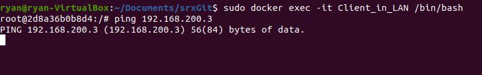

---

En effet, la communication entre les clients dans le LAN et les serveurs dans la DMZ doit passer à travers le Firewall. Dans certaines configuration, il est probable que le ping arrive à passer par le bridge par défaut. Ceci est une limitation de Docker. **Si votre ping passe**, vous pouvez accompagner votre capture du ping avec une capture d'une commande traceroute qui montre que le ping ne passe pas actuellement par le Firewall mais qu'il a emprunté un autre chemin.

Il faut donc définir le Firewall comme passerelle par défaut pour le client dans le LAN et le serveur dans la DMZ.

### Configuration du client LAN

Dans un terminal de votre client, taper les commandes suivantes :

```bash
ip route del default 
ip route add default via 192.168.100.2
```

### Configuration du serveur dans la DMZ

Dans un terminal de votre serveur dans DMZ, taper les commandes suivantes :

```bash
ip route del default 
ip route add default via 192.168.200.2

service nginx start
service ssh start
```

Les deux dernières commandes démarrent les services Web et SSH du serveur.

La communication devrait maintenant être possible entre les deux machines à travers le Firewall. Faites un nouveau test de ping, cette fois-ci depuis le serveur vers le client :

```bash
ping 192.168.100.3
```

---

**LIVRABLES : captures d'écran des routes des deux machines et de votre nouvelle tentative de ping.**

Route client :

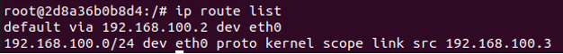

Route serveur

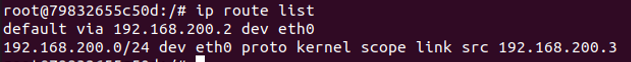

Ping effectué

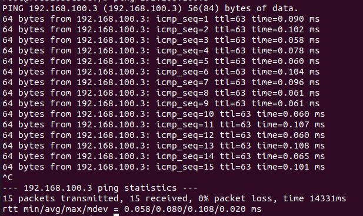

---

La communication est maintenant possible entre les deux machines. Pourtant, si vous essayez de communiquer depuis le client ou le serveur vers l'Internet, ça ne devrait pas encore fonctionner sans une manipulation supplémentaire au niveau du firewall ou sans un service de redirection ICMP. Vous pouvez le vérifier avec un ping depuis le client ou le serveur vers une adresse Internet. 

Par exemple :

```bash
ping 8.8.8.8
```

Si votre ping passe mais que la réponse contient un _Redirect Host_, ceci indique que votre ping est passé grace à la redirection ICMP, mais que vous n'arrivez pas encore à contacter l'Internet à travers de Firewall. Ceci est donc aussi valable pour l'instant et accepté comme résultat.

---

**LIVRABLE : capture d'écran de votre ping vers l'Internet. Un ping qui ne passe pas ou des réponses containant des _Redirect Host_ sont acceptés.**

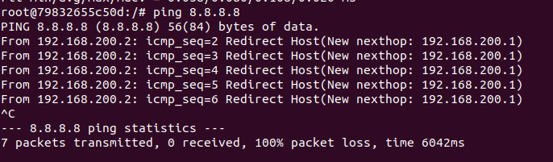

---

### Configuration réseau du firewall

On va fournir une route vers l'internet à travers le firewall aux deux réseaux connectés :

```bash
iptables -t nat -A POSTROUTING -o eth0 -j MASQUERADE
service ssh start
```

Cette commande `iptables` définit une règle dans le tableau NAT qui permet la redirection de ports et donc, l'accès à l'Internet pour les deux autres machines.

L'autre commande démarre le service SSH du serveur.

Vérifiez que la connexion à l'Internet est maintenant possible depuis les deux autres machines. Pas besoin de capture d'écran mais assurez vous que les pings passent sans besoin de redirection de host avant de continuer.


# Manipulations

## Création de règles

Une règle permet d’autoriser ou d’interdire une connexion. `iptables` met à disposition plusieurs options pour la création de ces règles. En particulier, on peut définir les politiques par défaut « Policy », des règles de filtrage pour le firewall (tableau filter) ou des fonctionnalités de translation d’adresses (tableau nat) :

- Policy permet d’appliquer des règles générales (**vous devez configurer vos politiques en premier**)
- Le tableau filter permet d’appliquer des règles de filtrage propres d’un firewall
- Le tableau nat permet de paramétrer la translation d’adresses

`iptables` vous permet la configuration de pare-feux avec et sans état. **Pour ce laboratoire, vous avez le choix d'utiliser le mode avec état, sans état ou une combinaison des deux**. 

Chaque règle doit être tapée sur une ligne séparée. Référez-vous à la théorie et appuyez-vous sur des informations trouvées sur Internet pour traduire votre tableau de règles de filtrage en commandes `iptables`. Les règles prennent effet immédiatement après avoir appuyé sur &lt;enter>\. Vous pouvez donc les tester au fur et à mesure que vous les configurez.


## Sauvegarde et récupération des règles

**Important** : Les règles de filtrage définies avec `iptables` ne sont pas persistantes (elles sont perdues après chaque redémarrage de la machine firewall). Pour sauvegarder votre configuration de firewall au fur et à mesure que vous avancez, vous pouvez utiliser les outils `iptables-save` et `iptables-restore`.

Sauvegarder la configuration du firewall dans le fichier `iptables.conf` :

```bash
iptables-save > iptables.conf
```

Récuperer la config sauvegardée :

```bash
iptables-restore < iptables.conf
```

&rarr; Note : pour plus de détails, la commande `iptables –L` affiche toutes les règles en vigueur.

&rarr; Note : avant chaque installation, la commande `iptables -F` efface les règles en vigueur. 

&rarr; Note : avant chaque installation, la commande `iptables –X` efface les chaînes.

&rarr; Note : Puisque vous travaillez depuis un terminal natif de votre machin hôte, vous pouvez facilement copier/coller les règles dans un fichier local. Vous pouvez ensuite les utiliser pour reconfigurer votre firewall en cas de besoin.

---

## Tests des connections et exemple de l'application d'une règle

Tout d'abord, nous établissons les politiques générales qui sont de tout bloquer par défaut (**condition 8 du cahier des charges**) : 

```
iptables -P INPUT DROP
iptables -P OUTPUT DROP
iptables -P FORWARD DROP
```

Pour chaque manipulation, il est important de **garder les règles déjà créées**, les nouvelles sont ajoutées aux existantes. 

Pour commencer sur une base fonctionnelle, nous allons configurer le pare-feu pour accepter le **ping** dans certains cas. Cela va permettre de tester la connectivité du réseau.

Le but est de configurer les règles pour que le pare-feu accepte
-	les ping depuis le LAN sur les machines de la DMZ,
-	les ping depuis le LAN sur le WAN,
-	les ping depuis la DMZ vers le LAN.

Ceci correspond a la **condition 2** du cahier des charges.

Commandes iptables :

---

```bash
#LAN vers DMZ et réponse
iptables -A FORWARD -s  192.168.100.0/24 -d 192.168.200.0/24 -p icmp --icmp-type 8 -j ACCEPT
iptables -A FORWARD -s  192.168.200.0/24 -d 192.168.100.0/24 -p icmp --icmp-type 0 -j ACCEPT

#LAN vers WAN et réponse
iptables -A FORWARD -s  192.168.100.0/24 -o eth0 -p icmp --icmp-type 8 -j ACCEPT
iptables -A FORWARD -i eth0 -d 192.168.100.0/24 -p icmp --icmp-type 0 -j ACCEPT

#DMZ vers LAN et réponse
iptables -A FORWARD -s  192.168.200.0/24 -d 192.168.100.0/24 -p icmp --icmp-type 8 -j ACCEPT
iptables -A FORWARD -s  192.168.100.0/24 -d 192.168.200.0/24 -p icmp --icmp-type 0 -j ACCEPT
```
---

### Questions

<ol type="a" start="2">
  <li>Afin de tester la connexion entre le client (Client_in_LAN) et le WAN, tapez la commande suivante depuis le client : 
  </li>                                  
</ol>

```bash
ping 8.8.8.8
```
Faire une capture du ping.

Vérifiez aussi la route entre votre client et le service `8.8.8.8`. Elle devrait partir de votre client et traverser votre Firewall :

```bash
traceroute 8.8.8.8
```


---
**LIVRABLE : capture d'écran du traceroute et de votre ping vers l'Internet. Il ne devrait pas y avoir des _Redirect Host_ dans les réponses au ping !**

**Ping du LAN vers le WAN  :**

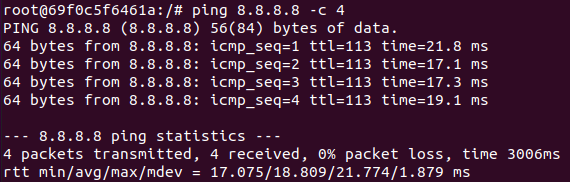


**Traceroute du LAN vers le WAN :**

Bien que le ping fonctionne, le traceroute n'affiche aucun nœud. Cela peut être dû à docker. 

Cependant, en spécifiant le protocole ICMP dans la commande, traceroute aboutis au serveur 8.8.8.8

```
traceroute -I 8.8.8.8
```

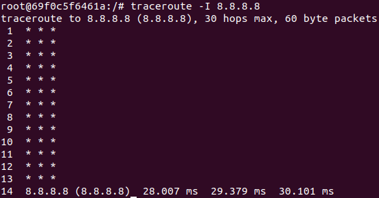

---

<ol type="a" start="3">
  <li>Testez ensuite toutes les règles, depuis le Client_in_LAN puis depuis le serveur Web (Server_in_DMZ) et remplir le tableau suivant : 
  </li>                                  
</ol>

| De Client\_in\_LAN à | OK/KO | Commentaires et explications                                 |
| :------------------- | :---: | :----------------------------------------------------------- |
| Interface DMZ du FW  |  KO   | Ajout d'une règle pour l'IP de l'interface si on veut que ca marche |
| Interface LAN du FW  |  KO   | Ajout d'une règle pour l'IP de l'interface si on veut que ca marche |
| Client LAN           |  OK   | -                                                            |
| Serveur WAN          |  OK   | -                                                            |


| De Server\_in\_DMZ à | OK/KO | Commentaires et explications                                 |
| :------------------- | :---: | :----------------------------------------------------------- |
| Interface DMZ du FW  |  KO   | Ajout d'une règle pour l'IP de l'interface si on veut que ca marche |
| Interface LAN du FW  |  KO   | Ajout d'une règle pour l'IP de l'interface si on veut que ca marche |
| Serveur DMZ          |  OK   | -                                                            |
| Serveur WAN          |  KO   | Règle déjà ajoutée pour interdire le ping de la DMZ vers le WAN |

## Règles pour le protocole DNS

<ol type="a" start="4">
  <li>Si un ping est effectué sur un serveur externe en utilisant en argument un nom DNS, le client ne pourra pas le résoudre. Le démontrer à l'aide d'une capture, par exemple avec la commande suivante : 
  </li>                                  
</ol>

```bash
ping www.google.com
```

* Faire une capture du ping.

---

**LIVRABLE : capture d'écran de votre ping.**

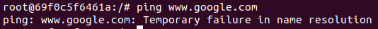

---

* Créer et appliquer la règle adéquate pour que la **condition 1 du cahier des charges** soit respectée.

Commandes iptables :

---

```bash
#LAN vers WAN (UDP) et réponse
iptables -A FORWARD -p udp -s 192.168.100.0/24 -o eth0 --dport 53 -j ACCEPT
iptables -A FORWARD -p udp -i eth0  --sport 53 -d 192.168.100.0/24  -j ACCEPT

#LAN vers WAN (TCP) et réponse
iptables -A FORWARD -p tcp -s 192.168.100.0/24 -o eth0 --dport 53 -j ACCEPT
iptables -A FORWARD -p tcp -i eth0  --sport 53 -d 192.168.100.0/24  -j ACCEPT
```

---

<ol type="a" start="5">
  <li>Tester en réitérant la commande ping sur le serveur de test (Google ou autre) : 
  </li>                                  
</ol>

---

**LIVRABLE : capture d'écran de votre ping.**

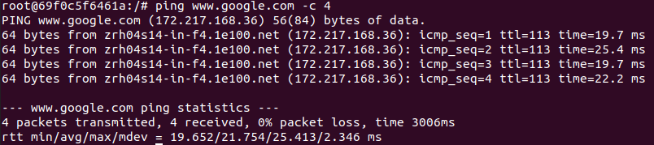

---

<ol type="a" start="6">
  <li>Remarques (sur le message du premier ping)? 
  </li>                                  
</ol>

---
**Réponse**

**LIVRABLE :** Le service DNS utilise le port 53, ce port n'étant pas autorisé avant d'avoir établis la règle, il était alors impossible pour le client de résoudre le nom de domaine. 

---


## Règles pour les protocoles HTTP et HTTPS

Créer et appliquer les règles adéquates pour que les **conditions 3 et 4 du cahier des charges** soient respectées. Tester que les règles soient fonctionnelles en utilisant wget depuis le Client\_in\_LAN pour télécharger une ressource depuis un site Web de votre choix (sur le WAN). Par exemple :

```bash
wget http://www.heig-vd.ch
```

* Créer et appliquer les règles adéquates avec des commandes iptables.

Commandes iptables :

*Nous avons configuré ces règles avec état car on estime important d'un point de vue sécuritaire qu'un serveur web ne puisse pas initier de connexion avec le client.*

---

```bash
#LAN vers WAN (HTTP) et réponse
iptables -A FORWARD -p tcp -s 192.168.100.0/24 -o eth0 --dport 80 -m conntrack --ctstate NEW,ESTABLISHED -j ACCEPT

iptables -A FORWARD -p tcp -i eth0 --sport 80 -d 192.168.100.0/24 -m conntrack --ctstate ESTABLISHED -j ACCEPT

#LAN vers WAN (HTTP) et réponse
iptables -A FORWARD -p tcp -s 192.168.100.0/24 -o eth0 --dport 8080 -m conntrack --ctstate NEW,ESTABLISHED -j ACCEPT

iptables -A FORWARD -p tcp -i eth0 --sport 8080 -d 192.168.100.0/24 -m conntrack --ctstate ESTABLISHED -j ACCEPT

#LAN vers WAN (HTTPS) et réponse
iptables -A FORWARD -p tcp -s 192.168.100.0/24 -o eth0 --dport 443 -m conntrack --ctstate NEW,ESTABLISHED -j ACCEPT

iptables -A FORWARD -p tcp -i eth0 --sport 443 -d 192.168.100.0/24 -m conntrack --ctstate ESTABLISHED -j ACCEPT
```

---

* Créer et appliquer les règles adéquates avec des commandes iptables pour que la **condition 5 du cahier des charges** soit respectée.

Commandes iptables :

---

```bash
#LAN vers Serveur Web (DMZ) et réponse
iptables -A FORWARD -p tcp -s 192.168.100.0/24 -d 192.168.200.3 --dport 80  -j ACCEPT
iptables -A FORWARD -p tcp -s 192.168.200.3 --sport 80 -d 192.168.100.0/24  -j ACCEPT

#WAN vers Serveur Web (DMZ) et réponse
iptables -A FORWARD -p tcp -i eth0 -d 192.168.200.3 --dport 80  -j ACCEPT
iptables -A FORWARD -p tcp -s 192.168.200.3  --sport 80 -o eth0 -j ACCEPT
```
---

<ol type="a" start="7">
  <li>Tester l’accès à ce serveur depuis le LAN utilisant utilisant wget (ne pas oublier les captures d'écran). 
  </li>                                  
</ol>

---

**LIVRABLE : capture d'écran.**

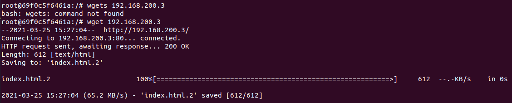

---

## Règles pour le protocole ssh

<ol type="a" start="8">
  <li>Créer et appliquer la règle adéquate pour que les <b>conditions 6 et 7 du cahier des charges</b> soient respectées. 
  </li>                                  
</ol>
Commandes iptables :

*Nous avons configuré ces règles avec état car on estime important d'un point de vue sécuritaire que seul le client ssh puisse initier la connexion. On évite ainsi que le serveur web, présente dans la DMZ ou le Firewall ne puissent initier la connexion ssh avec le client(et donc le contrôler à distance).*

---

```bash
#Client LAN vers Serveur Web (DMZ) et réponse
iptables -A FORWARD -p tcp -s 192.168.100.3 -d 192.168.200.3 --dport 22 -m conntrack  --ctstate NEW,ESTABLISHED -j ACCEPT

iptables -A FORWARD -p tcp -s 192.168.200.3 --sport 22 -d 192.168.100.3 -m conntrack  --ctstate ESTABLISHED -j ACCEPT

#Client LAN vers Firewall et réponse
iptables -A INPUT -p tcp -s 192.168.100.3 --dport 22 -m conntrack --ctstate NEW,ESTABLISHED -j ACCEPT

iptables -A OUTPUT -p tcp --sport 22 -d 192.168.100.3 -m conntrack --ctstate ESTABLISHED -j ACCEPT
```

---

Depuis le client dans le LAN, tester l’accès avec la commande suivante :

```bash
ssh root@192.168.200.3
```

---

**LIVRABLE : capture d'écran de votre connexion ssh.**

**Connexion SSH du lient LAN vers le serveur Web (DMZ) :**

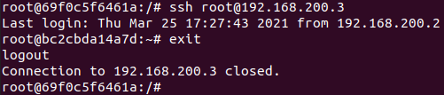


**Connexion SSH du client LAN vers le Firewall :**

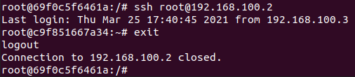

---

<ol type="a" start="9">
  <li>Expliquer l'utilité de <b>ssh</b> sur un serveur. 
  </li>                                  
</ol>

---
**Réponse**

**LIVRABLE :** SSH permet d'établir une connexion entre le client et le serveur de manière sécurisée. L'avantage est donc de pouvoir configurer et administrer le serveur à distance.

Les données sont chiffrées et le protocole est mieux sécurisée que par exemple avec telnet. On évite aussi dans ce cas la des attaques de type MITM car le serveur s'authentifie auprès du client et le client s'authentifie auprès du serveur.

---

<ol type="a" start="10">
  <li>En général, à quoi faut-il particulièrement faire attention lors de l'écriture des règles du pare-feu pour ce type de connexion ? 
  </li>                                  
</ol>
---
**Réponse**

**LIVRABLE :** Il faut écrire les règles de telle manière que seul le client concerné puisse établir une connexion. Sinon, il y a le risque que des pirates tentent une attaque brute-force sur le serveur pour trouver une paire utilisateur/mot de passe valide.

---

## Règles finales iptables

A présent, vous devriez avoir le matériel nécessaire afin de reproduire la table de filtrage que vous avez conçue au début de ce laboratoire.

<ol type="a" start="10">
  <li>Insérer la capture d’écran avec toutes vos règles iptables
  </li>                                  
</ol>

---

**LIVRABLE : capture d'écran avec toutes vos règles.**

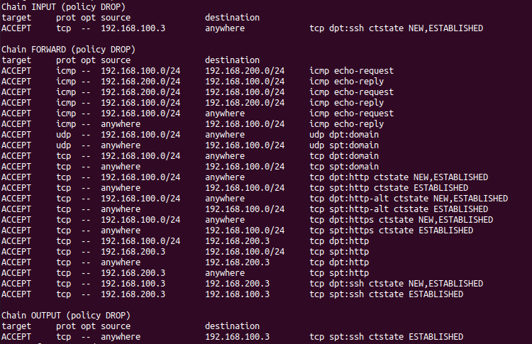

---